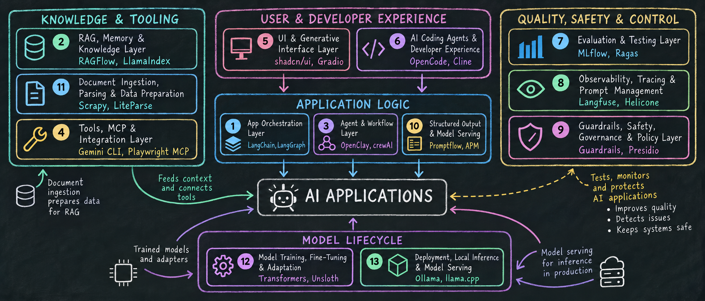
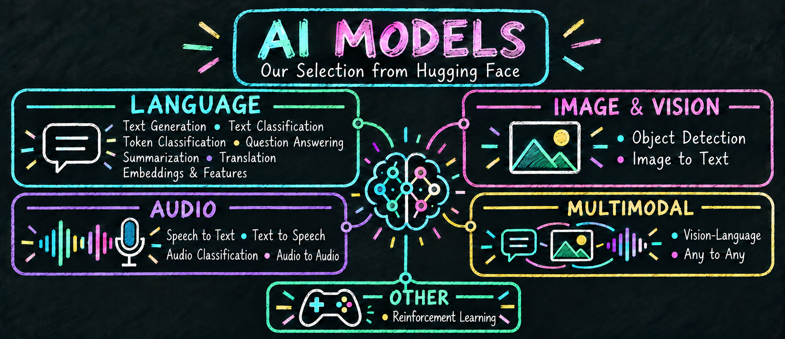

# Trending AI projects list

A curated overview of the top open-source AI repositories, organised by category. Each section covers a distinct layer of the modern AI stack — from orchestration frameworks and RAG pipelines to coding agents, evaluation tooling, and model serving infrastructure.
This list is subject to change and will be updated regularly.

*Maintained at [bobpage0451/ai-trending-repos](https://github.com/bobpage0451/ai-trending-repos) • Last updated: 2026-11-03 (refreshed bi-weekly)*

- [App orchestration layer](#app-orchestration-layer)
- [RAG, memory, and knowledge layer](#rag-memory-and-knowledge-layer)
- [Model access, routing, and gateway layer](#model-access-routing-and-gateway-layer)
- [Agent and workflow layer](#agent-and-workflow-layer)
- [Tools, MCP, and integration layer](#tools-mcp-and-integration-layer)
- [UI and generative interface layer](#ui-and-generative-interface-layer)
- [AI coding agents and developer experience](#ai-coding-agents-and-developer-experience)
- [Evaluation and testing layer](#evaluation-and-testing-layer)
- [Observability, tracing, and prompt management](#observability-tracing-and-prompt-management)
- [Guardrails, safety, governance, and policy layer](#guardrails-safety-governance-and-policy-layer)
- [Structured output and prompt engineering layer](#structured-output-and-prompt-engineering-layer)
- [Document ingestion, parsing, and data preparation](#document-ingestion-parsing-and-data-preparation)
- [Model training, fine-tuning, and adaptation](#model-training-fine-tuning-and-adaptation)
- [Deployment, local inference, and model serving layer](#deployment-local-inference-and-model-serving-layer)

---

## App orchestration layer

This is the core application framework layer for building AI apps. It helps structure LLM calls, chains, workflows, tool use, retrieval, memory, callbacks, and agent execution.

Connect prompts, models, tools, memory, retrieval, agents, and workflows.

| Repository | ⭐ Stars | 🍴 Forks | License | Language |
|---|---|---|---|---|
| [langchain-ai/langchain](https://github.com/langchain-ai/langchain) | 149k | 25044 |  |  |
| [langchain-ai/langgraph](https://github.com/langchain-ai/langgraph) | 44.4k | 7636 |  |  |
| [appsmithorg/appsmith](https://github.com/appsmithorg/appsmith) | 41.2k | 4826 |  |  |
| [agentscope-ai/QwenPaw](https://github.com/agentscope-ai/QwenPaw) | 37.3k | 3258 |  |  |
| [langchain-ai/deepagents](https://github.com/langchain-ai/deepagents) | 31k | 4350 |  |  |
| [QwenLM/qwen-code](https://github.com/QwenLM/qwen-code) | 29k | 3308 |  |  |
| [deepset-ai/haystack](https://github.com/deepset-ai/haystack) | 26.9k | 3387 |  | MDX |
| [google/adk-python](https://github.com/google/adk-python) | 22.1k | 4293 |  |  |
| [microsoft/agent-framework](https://github.com/microsoft/agent-framework) | 14.5k | 2570 |  |  |
| [vercel-labs/agent-desktop](https://github.com/vercel-labs/agent-desktop) | 12.4k | 857 |  |  |

## RAG, memory, and knowledge layer

This layer includes retrieval-augmented generation, semantic search, embeddings, vector storage, hybrid search, reranking, citations, document permissions, and short-term or long-term memory.

Give the model external, project, user, or company knowledge.

| Repository | ⭐ Stars | 🍴 Forks | License | Language |
|---|---|---|---|---|
| [Graphify-Labs/graphify](https://github.com/Graphify-Labs/graphify) | 141.8k | 13546 |  |  |
| [thedotmack/claude-mem](https://github.com/thedotmack/claude-mem) | 111.7k | 9727 |  |  |
| [infiniflow/ragflow](https://github.com/infiniflow/ragflow) | 93.4k | 11215 |  |  |
| [mem0ai/mem0](https://github.com/mem0ai/mem0) | 68.3k | 8110 |  |  |
| [MemPalace/mempalace](https://github.com/MemPalace/mempalace) | 60.3k | 7647 |  |  |
| [run-llama/llama_index](https://github.com/run-llama/llama_index) | 52.8k | 8503 |  |  |
| [milvus-io/milvus](https://github.com/milvus-io/milvus) | 46.6k | 4327 |  |  |
| [HKUDS/LightRAG](https://github.com/HKUDS/LightRAG) | 40.5k | 5756 |  |  |
| [VectifyAI/PageIndex](https://github.com/VectifyAI/PageIndex) | 40k | 3440 |  |  |
| [qdrant/qdrant](https://github.com/qdrant/qdrant) | 35.4k | 2797 |  |  |

## Model access, routing, and gateway layer

This layer provides provider abstraction, OpenAI-compatible APIs, model routing, retries, rate limits, caching, fallbacks, and cost tracking across OpenAI, Anthropic, Gemini, Mistral, local models, and other providers.

Avoid hardcoding your application to one model provider.

| Repository | ⭐ Stars | 🍴 Forks | License | Language |
|---|---|---|---|---|
| [rtk-ai/rtk](https://github.com/rtk-ai/rtk) | 85.5k | 5466 |  |  |
| [langchain-ai/open-swe](https://github.com/langchain-ai/open-swe) | 11.2k | 1314 |  |  |

## Agent and workflow layer

This layer covers tool-using agents, graph-based workflows, planner-executor patterns, multi-agent collaboration, human approval steps, state management, retries, and long-running task execution.

Build systems that can plan, call tools, perform multi-step tasks, and coordinate agents.

| Repository | ⭐ Stars | 🍴 Forks | License | Language |
|---|---|---|---|---|
| [morluto/rea](https://github.com/morluto/rea) | 426.6k | 106213 |  |  |
| [openclaw/openclaw](https://github.com/openclaw/openclaw) | 393.9k | 82781 |  |  |
| [langflow-ai/langflow](https://github.com/langflow-ai/langflow) | 156.3k | 10315 |  |  |
| [bytedance/deer-flow](https://github.com/bytedance/deer-flow) | 85k | 11933 |  |  |
| [FoundationAgents/MetaGPT](https://github.com/FoundationAgents/MetaGPT) | 71.2k | 9087 |  |  |
| [crewAIInc/crewAI](https://github.com/crewAIInc/crewAI) | 60.5k | 9020 |  |  |
| [agno-agi/agno](https://github.com/agno-agi/agno) | 43k | 6238 |  |  |
| [OpenBMB/ChatDev](https://github.com/OpenBMB/ChatDev) | 34.6k | 4335 |  |  |
| [openai/openai-agents-python](https://github.com/openai/openai-agents-python) | 30.5k | 4980 |  |  |
| [huggingface/smolagents](https://github.com/huggingface/smolagents) | 30.2k | 3193 |  |  |

## Tools, MCP, and integration layer

This layer includes Model Context Protocol servers and clients, tool schemas, function calling, API connectors, filesystem access, browser access, database access, and integrations with services like GitHub, Slack, Google Drive, and internal tools.

Let models and agents interact with external systems, APIs, databases, files, and tools.

| Repository | ⭐ Stars | 🍴 Forks | License | Language |
|---|---|---|---|---|
| [browser-use/browser-use](https://github.com/browser-use/browser-use) | 120k | 13367 |  |  |
| [google-gemini/gemini-cli](https://github.com/google-gemini/gemini-cli) | 108.7k | 14916 |  |  |
| [D4Vinci/Scrapling](https://github.com/D4Vinci/Scrapling) | 94.5k | 9912 |  |  |
| [heygen-com/hyperframes](https://github.com/heygen-com/hyperframes) | 78.3k | 7205 |  |  |
| [microsoft/playwright-mcp](https://github.com/microsoft/playwright-mcp) | 39.1k | 3378 |  |  |
| [ComposioHQ/composio](https://github.com/ComposioHQ/composio) | 30.9k | 4914 |  |  |
| [PrefectHQ/fastmcp](https://github.com/PrefectHQ/fastmcp) | 28.3k | 2558 |  |  |
| [browser-use/browser-harness](https://github.com/browser-use/browser-harness) | 18.8k | 1860 |  |  |
| [microsoft/mcp-for-beginners](https://github.com/microsoft/mcp-for-beginners) | 17.6k | 5681 |  |  |
| [mcp-use/mcp-use](https://github.com/mcp-use/mcp-use) | 10.8k | 1537 |  |  |

## UI and generative interface layer

This layer is more than normal frontend. It includes chat UIs, streaming responses, agent dashboards, tool-call displays, generated UI, copilot components, diff viewers, file attachments, code previews, and human approval interfaces.

Build the user-facing interface for AI applications.

| Repository | ⭐ Stars | 🍴 Forks | License | Language |
|---|---|---|---|---|
| [shadcn-ui/ui](https://github.com/shadcn-ui/ui) | 127.3k | 12006 |  |  |
| [streamlit/streamlit](https://github.com/streamlit/streamlit) | 46.2k | 4446 |  |  |
| [gradio-app/gradio](https://github.com/gradio-app/gradio) | 44k | 3660 |  |  |
| [CopilotKit/CopilotKit](https://github.com/CopilotKit/CopilotKit) | 38.5k | 4802 |  |  |
| [simstudioai/sim](https://github.com/simstudioai/sim) | 30k | 3882 |  |  |
| [microsoft/semantic-kernel](https://github.com/microsoft/semantic-kernel) | 28.7k | 4853 |  |  |
| [thesysdev/openui](https://github.com/thesysdev/openui) | 14.7k | 974 |  |  |
| [assistant-ui/assistant-ui](https://github.com/assistant-ui/assistant-ui) | 12.9k | 1310 |  |  |
| [tambo-ai/tambo](https://github.com/tambo-ai/tambo) | 11.2k | 575 |  |  |
| [huggingface/chat-ui](https://github.com/huggingface/chat-ui) | 11k | 1715 |  |  |

## AI coding agents and developer experience

This category includes AI coding assistants, autonomous coding agents, repo-editing agents, terminal agents, IDE extensions, pair programmers, code review tools, and systems that inspect, modify, test, and explain codebases.

Help developers write, edit, review, understand, and run code with AI.

| Repository | ⭐ Stars | 🍴 Forks | License | Language |
|---|---|---|---|---|
| [NousResearch/hermes-agent](https://github.com/NousResearch/hermes-agent) | 260.2k | 57342 |  |  |
| [anomalyco/opencode](https://github.com/anomalyco/opencode) | 224.3k | 30195 |  |  |
| [DietrichGebert/ponytail](https://github.com/DietrichGebert/ponytail) | 183.7k | 10135 |  |  |
| [openai/codex](https://github.com/openai/codex) | 133k | 21055 |  |  |
| [JuliusBrussee/caveman](https://github.com/JuliusBrussee/caveman) | 117.2k | 6802 |  |  |
| [puppeteer/puppeteer](https://github.com/puppeteer/puppeteer) | 95.8k | 9591 |  |  |
| [cline/cline](https://github.com/cline/cline) | 71.3k | 7845 |  |  |
| [Aider-AI/aider](https://github.com/Aider-AI/aider) | 49.9k | 5130 |  |  |
| [continuedev/continue](https://github.com/continuedev/continue) | 36.4k | 5547 |  |  |
| [SWE-agent/SWE-agent](https://github.com/SWE-agent/SWE-agent) | 20.7k | 2264 |  |  |

## Evaluation and testing layer

This layer includes prompt tests, regression tests, model comparisons, RAG evaluation, hallucination checks, LLM-as-judge metrics, agent task success evaluation, red-team tests, and CI/CD quality gates.

Measure whether an AI app, prompt, RAG pipeline, model, or agent is improving or getting worse.

| Repository | ⭐ Stars | 🍴 Forks | License | Language |
|---|---|---|---|---|
| [usestrix/strix](https://github.com/usestrix/strix) | 73.6k | 8278 |  |  |
| [ifixai-ai/iFixAi](https://github.com/ifixai-ai/iFixAi) | 43.2k | 1781 |  |  |
| [mlflow/mlflow](https://github.com/mlflow/mlflow) | 28.7k | 6575 |  |  |
| [promptfoo/promptfoo](https://github.com/promptfoo/promptfoo) | 26.8k | 2643 |  |  |
| [vibrantlabsai/ragas](https://github.com/vibrantlabsai/ragas) | 16.2k | 1798 |  |  |
| [EleutherAI/lm-evaluation-harness](https://github.com/EleutherAI/lm-evaluation-harness) | 14.4k | 3759 |  |  |
| [NVIDIA/garak](https://github.com/NVIDIA/garak) | 9.8k | 1440 |  |  |
| [microsoft/PyRIT](https://github.com/microsoft/PyRIT) | 4.7k | 1020 |  |  |
| [truera/trulens](https://github.com/truera/trulens) | 3.6k | 386 |  |  |
| [huggingface/lighteval](https://github.com/huggingface/lighteval) | 2.6k | 605 |  |  |

## Observability, tracing, and prompt management

This layer gives visibility into what happened inside an AI system. It includes tracing, span trees, prompt logs, completion logs, token usage, cost monitoring, feedback capture, prompt versioning, and evaluation dashboards.

Track prompts, completions, costs, latency, errors, tool calls, traces, retrieved context, and feedback.

| Repository | ⭐ Stars | 🍴 Forks | License | Language |
|---|---|---|---|---|
| [headroomlabs-ai/headroom](https://github.com/headroomlabs-ai/headroom) | 78.7k | 6149 |  |  |
| [evidentlyai/evidently](https://github.com/evidentlyai/evidently) | 8k | 964 |  |  |
| [traceloop/openllmetry](https://github.com/traceloop/openllmetry) | 7.5k | 1185 |  |  |
| [Helicone/helicone](https://github.com/Helicone/helicone) | 6.3k | 702 |  |  |
| [coze-dev/coze-loop](https://github.com/coze-dev/coze-loop) | 5.8k | 803 |  |  |
| [latitude-dev/latitude-llm](https://github.com/latitude-dev/latitude-llm) | 4.7k | 408 |  |  |

## Guardrails, safety, governance, and policy layer

This layer includes input and output filters, PII detection, jailbreak and prompt-injection defenses, safe tool calling, policy engines, human approvals, governance, compliance, audit logs, and red-team testing.

Prevent harmful outputs, unsafe tool calls, prompt injection, data leakage, and uncontrolled agent behavior.

| Repository | ⭐ Stars | 🍴 Forks | License | Language |
|---|---|---|---|---|
| [NVIDIA/SkillSpector](https://github.com/NVIDIA/SkillSpector) | 24.2k | 2084 |  |  |
| [data-privacy-stack/presidio](https://github.com/data-privacy-stack/presidio) | 11.7k | 1414 |  |  |
| [microsoft/presidio](https://github.com/microsoft/presidio) | 11.7k | 1414 |  |  |
| [guardrails-ai/guardrails](https://github.com/guardrails-ai/guardrails) | 7.6k | 736 |  |  |
| [superagent-ai/superagent](https://github.com/superagent-ai/superagent) | 6.8k | 966 |  |  |
| [microsoft/agent-governance-toolkit](https://github.com/microsoft/agent-governance-toolkit) | 6.5k | 1126 |  |  |
| [agentcontrol/agent-control](https://github.com/agentcontrol/agent-control) | 332 | 57 |  |  |

## Structured output and prompt engineering layer

This layer covers JSON schema outputs, function calling, typed model responses, constrained generation, grammar-constrained decoding, Pydantic-style validation, prompt templates, retries, and prompt optimization.

Make model outputs reliable, parseable, schema-valid, and usable by software.

| Repository | ⭐ Stars | 🍴 Forks | License | Language |
|---|---|---|---|---|
| [microsoft/promptflow](https://github.com/microsoft/promptflow) | 11.3k | 1125 |  |  |
| [IBM/mcp-context-forge](https://github.com/IBM/mcp-context-forge) | 4.7k | 957 |  |  |
| [microsoft/apm](https://github.com/microsoft/apm) | 4.2k | 414 |  |  |

## Document ingestion, parsing, and data preparation

This layer includes PDF parsing, OCR, HTML cleanup, document ingestion, markdown conversion, table extraction, metadata extraction, deduplication, web crawling, and connector-based ingestion for RAG systems.

Convert messy real-world content into LLM-ready text and metadata.

| Repository | ⭐ Stars | 🍴 Forks | License | Language |
|---|---|---|---|---|
| [PaddlePaddle/PaddleOCR](https://github.com/PaddlePaddle/PaddleOCR) | 92.2k | 11615 |  |  |
| [unclecode/crawl4ai](https://github.com/unclecode/crawl4ai) | 86.8k | 9046 |  |  |
| [scrapy/scrapy](https://github.com/scrapy/scrapy) | 65.2k | 12092 |  |  |
| [opendataloader-project/opendataloader-pdf](https://github.com/opendataloader-project/opendataloader-pdf) | 30.2k | 2883 |  |  |
| [run-llama/liteparse](https://github.com/run-llama/liteparse) | 13k | 897 |  |  |

## Model training, fine-tuning, and adaptation

For most app builders, this is not the first layer to learn, but it is part of the full picture. It includes supervised fine-tuning, LoRA, QLoRA, PEFT, DPO, RLHF, instruction tuning, adapter training, dataset formatting, and model export.

Customize models when prompting, RAG, and tool use are not enough.

| Repository | ⭐ Stars | 🍴 Forks | License | Language |
|---|---|---|---|---|
| [huggingface/transformers](https://github.com/huggingface/transformers) | 168.5k | 35098 |  |  |
| [unslothai/unsloth](https://github.com/unslothai/unsloth) | 79k | 7351 |  |  |
| [pandas-dev/pandas](https://github.com/pandas-dev/pandas) | 50.3k | 20707 |  |  |
| [hpcaitech/ColossalAI](https://github.com/hpcaitech/ColossalAI) | 41.4k | 4486 |  |  |
| [lm-sys/FastChat](https://github.com/lm-sys/FastChat) | 39.6k | 4773 |  |  |
| [microsoft/onnxruntime](https://github.com/microsoft/onnxruntime) | 22.2k | 4401 |  |  |

## Deployment, local inference, and model serving layer

This layer includes local model runners, inference servers, OpenAI-compatible local APIs, high-throughput serving, GPU inference, batching, quantization, autoscaling, Kubernetes deployment, and model-serving infrastructure.

Run models and AI services reliably in local, cloud, or production environments.

| Repository | ⭐ Stars | 🍴 Forks | License | Language |
|---|---|---|---|---|
| [ollama/ollama](https://github.com/ollama/ollama) | 185.8k | 18861 |  |  |
| [ggml-org/llama.cpp](https://github.com/ggml-org/llama.cpp) | 133.3k | 25103 |  |  |
| [vllm-project/vllm](https://github.com/vllm-project/vllm) | 96.2k | 24354 |  |  |
| [hiyouga/LlamaFactory](https://github.com/hiyouga/LlamaFactory) | 75.9k | 9338 |  |  |
| [mudler/LocalAI](https://github.com/mudler/LocalAI) | 50.2k | 4573 |  |  |
| [ray-project/ray](https://github.com/ray-project/ray) | 44.2k | 8242 |  |  |
| [deepspeedai/DeepSpeed](https://github.com/deepspeedai/DeepSpeed) | 43.3k | 5062 |  |  |
| [sgl-project/sglang](https://github.com/sgl-project/sglang) | 38.4k | 10123 |  |  |

---

## AI Models — Our Selection from Hugging Face

A hand-picked set of models we track, organized by category and task using our mapping of Hugging Face `pipeline_tag` values. These are selected models, rather than a comprehensive popularity ranking.

Model metadata is sourced from the [Hugging Face API](https://huggingface.co/docs/hub/api). Counts reflect this selection.

| Category | Tasks represented | Models |
|---|---|---|
| [Language](#language) | 9 | 78 |
| [Image & Vision](#image-vision) | 5 | 21 |
| [Audio](#audio) | 4 | 42 |
| [Multimodal](#multimodal) | 2 | 20 |
| [Other](#other) | 1 | 3 |

### Language

[Text Generation (21)](#text-generation) · [Text Classification (5)](#text-classification) · [Token Classification (9)](#token-classification) · [Question Answering (6)](#question-answering) · [Summarization (3)](#summarization) · [Translation (12)](#translation) · [Embeddings & Similarity (2)](#embeddings-similarity) · [Embeddings & Features (17)](#embeddings-features) · [Fill Mask (3)](#fill-mask)

#### Text Generation

Creates new text by continuing a prompt or responding to instructions.

| Model | Downloads (30d) | Downloads (all time) | Likes | Last updated | License |
|---|---|---|---|---|---|
| [prism-ml/Ternary-Bonsai-2-27B-gguf](https://huggingface.co/prism-ml/Ternary-Bonsai-2-27B-gguf) | 1.8M | 5.9M | 2912 | Oct 2026 |  |
| [ConwayResearch/Underdog-Saluki-27B-1.0](https://huggingface.co/ConwayResearch/Underdog-Saluki-27B-1.0) | 717k | 717k | 689 | Oct 2026 |  |
| [openbmb/MiniCPM5-2B](https://huggingface.co/openbmb/MiniCPM5-2B) | 1.1M | 2.2M | 1835 | Sep 2026 |  |
| [nvidia/Qwen3.6-35B-A3B-NVFP4](https://huggingface.co/nvidia/Qwen3.6-35B-A3B-NVFP4) | 3.8M | 41.1M | 674 | Aug 2026 |  |
| [nvidia/Qwen3.8-27B-NVFP4](https://huggingface.co/nvidia/Qwen3.8-27B-NVFP4) | 228.2k | 816.6k | 226 | Sep 2026 |  |
| [ornith-ai/Ornith-1.5-9B-GGUF](https://huggingface.co/ornith-ai/Ornith-1.5-9B-GGUF) | 5.5M | 14M | 628 | Aug 2026 |  |
| [ornith-ai/Ornith-1.5-35B-A3B-GGUF](https://huggingface.co/ornith-ai/Ornith-1.5-35B-A3B-GGUF) | 4.1M | 10.8M | 572 | Aug 2026 |  |
| [deepseek-ai/DeepSeek-V4-Flash-0731](https://huggingface.co/deepseek-ai/DeepSeek-V4-Flash-0731) | 3M | 13M | 4095 | Aug 2026 |  |
| [Aleph-Alpha/Kolibri-1](https://huggingface.co/Aleph-Alpha/Kolibri-1) | 22.8k | 25.1k | 1001 | Oct 2026 |  |
| [deepseek-ai/DeepSeek-V4-Pro](https://huggingface.co/deepseek-ai/DeepSeek-V4-Pro) | 353.6k | 11.1M | 5695 | Jun 2026 |  |

#### Text Classification

Assigns labels to a piece of text, such as its topic, sentiment, or whether it is spam.

| Model | Downloads (30d) | Downloads (all time) | Likes | Last updated | License |
|---|---|---|---|---|---|
| [fastino/GLiNER2.5-Decide](https://huggingface.co/fastino/GLiNER2.5-Decide) | 126.8k | 185.2k | 448 | Oct 2026 |  |
| [convaiinnovations/laya](https://huggingface.co/convaiinnovations/laya) | 51.7k | 62k | 5894 | Oct 2026 |  |
| [convaiinnovations/laya-multilingual](https://huggingface.co/convaiinnovations/laya-multilingual) | 17.5k | 18.1k | 416 | Oct 2026 |  |
| [BAAI/bge-reranker-v2-m3](https://huggingface.co/BAAI/bge-reranker-v2-m3) | 14.4M | 163.4M | 1286 | Jun 2024 |  |
| [distilbert/distilbert-base-uncased-finetuned-sst-2-english](https://huggingface.co/distilbert/distilbert-base-uncased-finetuned-sst-2-english) | 2.8M | 406.3M | 1002 | Dec 2023 |  |

#### Token Classification

Labels individual words or tokens in text, for example to identify people, organizations, and places.

| Model | Downloads (30d) | Downloads (all time) | Likes | Last updated | License |
|---|---|---|---|---|---|
| [fastino/gliner2-privacy-filter-PII-multi](https://huggingface.co/fastino/gliner2-privacy-filter-PII-multi) | 155.8k | 636.5k | 110 | Sep 2026 |  |
| [openai/privacy-filter](https://huggingface.co/openai/privacy-filter) | 106.2k | 2.2M | 1826 | Apr 2026 |  |
| [Qwen/Qwen3-ForcedAligner-0.6B-hf](https://huggingface.co/Qwen/Qwen3-ForcedAligner-0.6B-hf) | 60.9k | 360.5k | 51 | Jun 2026 |  |
| [perplexity-ai/PII-Tracer](https://huggingface.co/perplexity-ai/PII-Tracer) | 7.4k | 11.9k | 93 | Sep 2026 |  |
| [OpenMed/privacy-filter-multilingual](https://huggingface.co/OpenMed/privacy-filter-multilingual) | 134.1k | 481.9k | 24 | May 2026 |  |
| [OpenMed/OpenMed-PII-SuperClinical-Large-434M-v1](https://huggingface.co/OpenMed/OpenMed-PII-SuperClinical-Large-434M-v1) | 109.8k | 696.5k | 27 | Jan 2026 |  |
| [dslim/bert-base-NER](https://huggingface.co/dslim/bert-base-NER) | 1.1M | 98.8M | 747 | Oct 2024 |  |
| [microsoft/llmlingua-2-xlm-roberta-large-meetingbank](https://huggingface.co/microsoft/llmlingua-2-xlm-roberta-large-meetingbank) | 65.6k | 3.6M | 37 | Jan 2025 |  |
| [dslim/distilbert-NER](https://huggingface.co/dslim/distilbert-NER) | 79.4k | 2.9M | 54 | Oct 2024 |  |

#### Question Answering

Finds the answer to a question in a supplied passage.

| Model | Downloads (30d) | Downloads (all time) | Likes | Last updated | License |
|---|---|---|---|---|---|
| [deepset/roberta-base-squad2](https://huggingface.co/deepset/roberta-base-squad2) | 446.7k | 92.8M | 978 | Sep 2024 | cc-by-4.0 |
| [distilbert/distilbert-base-cased-distilled-squad](https://huggingface.co/distilbert/distilbert-base-cased-distilled-squad) | 142.2k | 26.6M | 278 | May 2024 |  |
| [distilbert/distilbert-base-uncased-distilled-squad](https://huggingface.co/distilbert/distilbert-base-uncased-distilled-squad) | 29.5k | 13.3M | 123 | May 2024 |  |
| [google-bert/bert-large-uncased-whole-word-masking-finetuned-squad](https://huggingface.co/google-bert/bert-large-uncased-whole-word-masking-finetuned-squad) | 26.6k | 37.4M | 192 | Feb 2024 |  |
| [google-bert/bert-large-cased-whole-word-masking-finetuned-squad](https://huggingface.co/google-bert/bert-large-cased-whole-word-masking-finetuned-squad) | 46.5k | 2.4M | 2 | Feb 2024 |  |
| [AmazonScience/qanlu](https://huggingface.co/AmazonScience/qanlu) | 30 | 15.1k | 14 | Sep 2021 | cc-by-4.0 |

#### Summarization

Condenses longer text into a shorter version that preserves its main points.

| Model | Downloads (30d) | Downloads (all time) | Likes | Last updated | License |
|---|---|---|---|---|---|
| [facebook/bart-large-cnn](https://huggingface.co/facebook/bart-large-cnn) | 1.1M | 150.4M | 1648 | Feb 2024 |  |
| [Falconsai/text_summarization](https://huggingface.co/Falconsai/text_summarization) | 22.7k | 2.1M | 331 | Feb 2024 |  |
| [google/roberta2roberta_L-24_bbc](https://huggingface.co/google/roberta2roberta_L-24_bbc) | 272 | 30.7k | 8 | Jan 2023 |  |

#### Translation

Converts text from one language into another while preserving its meaning.

| Model | Downloads (30d) | Downloads (all time) | Likes | Last updated | License |
|---|---|---|---|---|---|
| [ai4bharat/indictrans2-en-indic-dist-200M](https://huggingface.co/ai4bharat/indictrans2-en-indic-dist-200M) | 241.8k | 1.1M | 85 | Oct 2026 |  |
| [tencent/Hy-MT2-1.8B](https://huggingface.co/tencent/Hy-MT2-1.8B) | 24.1k | 292k | 1274 | May 2026 |  |
| [tencent/Hy-MT2-30B-A3B](https://huggingface.co/tencent/Hy-MT2-30B-A3B) | 3.6k | 239.7k | 514 | Jul 2026 |  |
| [netease-youdao/Confucius4-T3PO](https://huggingface.co/netease-youdao/Confucius4-T3PO) | 530 | 2.1k | 80 | Oct 2026 |  |
| [google-t5/t5-base](https://huggingface.co/google-t5/t5-base) | 2.6M | 177.4M | 809 | Feb 2024 |  |
| [google-t5/t5-3b](https://huggingface.co/google-t5/t5-3b) | 231.4k | 21.5M | 53 | Jan 2024 |  |
| [Helsinki-NLP/opus-mt-zh-en](https://huggingface.co/Helsinki-NLP/opus-mt-zh-en) | 682.2k | 69.6M | 566 | Aug 2023 | cc-by-4.0 |
| [google/madlad400-3b-mt](https://huggingface.co/google/madlad400-3b-mt) | 35.3k | 4.6M | 245 | Nov 2023 |  |
| [google-t5/t5-small](https://huggingface.co/google-t5/t5-small) | 23.1M | 302.3M | 688 | Jun 2023 |  |
| [Helsinki-NLP/opus-mt-es-en](https://huggingface.co/Helsinki-NLP/opus-mt-es-en) | 141.8k | 26.4M | 82 | Aug 2023 |  |

#### Embeddings & Similarity

| Model | Downloads (30d) | Downloads (all time) | Likes | Last updated | License |
|---|---|---|---|---|---|
| [Snowflake/snowflake-arctic-embed-m-v2.0](https://huggingface.co/Snowflake/snowflake-arctic-embed-m-v2.0) | 52.3k | 3.2M | 110 | Apr 2025 |  |
| [Snowflake/snowflake-arctic-embed-m](https://huggingface.co/Snowflake/snowflake-arctic-embed-m) | 387.7k | 12M | 169 | Dec 2024 |  |

#### Embeddings & Features

Turns text into numerical representations that help compare meanings, find similar content, or support other machine learning tasks.

| Model | Downloads (30d) | Downloads (all time) | Likes | Last updated | License |
|---|---|---|---|---|---|
| [google/embeddinggemma-2](https://huggingface.co/google/embeddinggemma-2) | 431.3k | 431.6k | 3101 | Oct 2026 |  |
| [ibm-research/MoLFormer-XL-both-10pct](https://huggingface.co/ibm-research/MoLFormer-XL-both-10pct) | 233k | 9.4M | 43 | Jul 2026 |  |
| [Qwen/Qwen3-Embedding-0.6B](https://huggingface.co/Qwen/Qwen3-Embedding-0.6B) | 9M | 101.2M | 1323 | Apr 2026 |  |
| [intfloat/multilingual-e5-large](https://huggingface.co/intfloat/multilingual-e5-large) | 6.8M | 119.7M | 1282 | Apr 2026 |  |
| [ibm-granite/granite-embedding-small-english-r2](https://huggingface.co/ibm-granite/granite-embedding-small-english-r2) | 6.8M | 33.6M | 113 | Jan 2026 |  |
| [Qwen/Qwen3-Embedding-8B](https://huggingface.co/Qwen/Qwen3-Embedding-8B) | 2.2M | 26.9M | 845 | Jul 2025 |  |
| [intfloat/multilingual-e5-large-instruct](https://huggingface.co/intfloat/multilingual-e5-large-instruct) | 1.8M | 35.4M | 656 | Jul 2025 |  |
| [Xenova/all-MiniLM-L6-v2](https://huggingface.co/Xenova/all-MiniLM-L6-v2) | 4.6M | 34.8M | 179 | Jul 2025 |  |
| [Qwen/Qwen3-Embedding-4B](https://huggingface.co/Qwen/Qwen3-Embedding-4B) | 2.3M | 24M | 345 | Jun 2025 |  |
| [BAAI/bge-large-zh-v1.5](https://huggingface.co/BAAI/bge-large-zh-v1.5) | 348.5k | 28.2M | 650 | Apr 2024 |  |

#### Fill Mask

| Model | Downloads (30d) | Downloads (all time) | Likes | Last updated | License |
|---|---|---|---|---|---|
| [google-bert/bert-base-uncased](https://huggingface.co/google-bert/bert-base-uncased) | 29.6M | 3282.9M | 3060 | Feb 2024 |  |
| [FacebookAI/xlm-roberta-base](https://huggingface.co/FacebookAI/xlm-roberta-base) | 8.5M | 737.2M | 968 | Feb 2024 |  |
| [FacebookAI/xlm-roberta-large](https://huggingface.co/FacebookAI/xlm-roberta-large) | 2.3M | 721.8M | 555 | Feb 2024 |  |

### Image & Vision

[Text to Image (2)](#text-to-image) · [Image Classification (6)](#image-classification) · [Object Detection (7)](#object-detection) · [Image to Text (1)](#image-to-text) · [Text to Video (5)](#text-to-video)

#### Text to Image

| Model | Downloads (30d) | Downloads (all time) | Likes | Last updated | License |
|---|---|---|---|---|---|
| [Tongyi-MAI/Z-Image-Turbo](https://huggingface.co/Tongyi-MAI/Z-Image-Turbo) | 744.1k | 9.9M | 5548 | Jan 2026 |  |
| [black-forest-labs/FLUX.1-schnell](https://huggingface.co/black-forest-labs/FLUX.1-schnell) | 328k | 23.5M | 6584 | Aug 2024 |  |

#### Image Classification

| Model | Downloads (30d) | Downloads (all time) | Likes | Last updated | License |
|---|---|---|---|---|---|
| [pixai-labs/pixai-tagger-v1.0](https://huggingface.co/pixai-labs/pixai-tagger-v1.0) | 35.2k | 48.7k | 154 | Sep 2026 |  |
| [PSRben/VisionHOPE](https://huggingface.co/PSRben/VisionHOPE) | 320 | 2k | 216 | Sep 2026 |  |
| [microsoft/resnet-50](https://huggingface.co/microsoft/resnet-50) | 228.2k | 574.7M | 530 | Feb 2024 |  |
| [microsoft/resnet-18](https://huggingface.co/microsoft/resnet-18) | 566.2k | 30.1M | 96 | Apr 2024 |  |
| [google/vit-base-patch16-224](https://huggingface.co/google/vit-base-patch16-224) | 15.8M | 205.1M | 1049 | Sep 2023 |  |
| [google/vit-large-patch16-224](https://huggingface.co/google/vit-large-patch16-224) | 27.9k | 2.9M | 57 | Jun 2022 |  |

#### Object Detection

| Model | Downloads (30d) | Downloads (all time) | Likes | Last updated | License |
|---|---|---|---|---|---|
| [Salesforce/GPA-GUI-Detector](https://huggingface.co/Salesforce/GPA-GUI-Detector) | 288 | 54.4k | 23 | Feb 2026 |  |
| [facebook/detr-resnet-50](https://huggingface.co/facebook/detr-resnet-50) | 96.1k | 28M | 991 | Apr 2024 |  |
| [hustvl/yolos-small](https://huggingface.co/hustvl/yolos-small) | 734.6k | 14.3M | 101 | May 2024 |  |
| [hustvl/yolos-tiny](https://huggingface.co/hustvl/yolos-tiny) | 87.1k | 12.1M | 282 | Apr 2024 |  |
| [microsoft/table-transformer-structure-recognition-v1.1-all](https://huggingface.co/microsoft/table-transformer-structure-recognition-v1.1-all) | 141.5k | 18.7M | 91 | Nov 2023 |  |
| [microsoft/table-transformer-structure-recognition](https://huggingface.co/microsoft/table-transformer-structure-recognition) | 1.4M | 40.5M | 244 | Sep 2023 |  |
| [facebook/detr-resnet-101](https://huggingface.co/facebook/detr-resnet-101) | 21k | 7.7M | 136 | Dec 2023 |  |

#### Image to Text

| Model | Downloads (30d) | Downloads (all time) | Likes | Last updated | License |
|---|---|---|---|---|---|
| [microsoft/trocr-base-handwritten](https://huggingface.co/microsoft/trocr-base-handwritten) | 103.6k | 30.9M | 534 | Feb 2025 |  |

#### Text to Video

| Model | Downloads (30d) | Downloads (all time) | Likes | Last updated | License |
|---|---|---|---|---|---|
| [larryvrh/MiniMax-H3-Turbo-Lora](https://huggingface.co/larryvrh/MiniMax-H3-Turbo-Lora) | 209.5k | 1.1M | 1220 | Aug 2026 |  |
| [QuantStack/Wan2.2-T2V-A14B-GGUF](https://huggingface.co/QuantStack/Wan2.2-T2V-A14B-GGUF) | 455.3k | 3.1M | 310 | Jul 2025 |  |
| [Wan-AI/Wan2.1-T2V-14B](https://huggingface.co/Wan-AI/Wan2.1-T2V-14B) | 103.7k | 1.3M | 1615 | Mar 2025 |  |
| [Wan-AI/Wan2.1-T2V-1.3B-Diffusers](https://huggingface.co/Wan-AI/Wan2.1-T2V-1.3B-Diffusers) | 348.5k | 3.1M | 166 | Apr 2025 |  |
| [Wan-AI/Wan2.1-T2V-1.3B](https://huggingface.co/Wan-AI/Wan2.1-T2V-1.3B) | 88.6k | 512.3k | 657 | Mar 2025 |  |

### Audio

[Speech to Text (15)](#speech-to-text) · [Text to Speech (10)](#text-to-speech) · [Audio Classification (5)](#audio-classification) · [Audio to Audio (12)](#audio-to-audio)

#### Speech to Text

| Model | Downloads (30d) | Downloads (all time) | Likes | Last updated | License |
|---|---|---|---|---|---|
| [Cactus-Compute/whistle](https://huggingface.co/Cactus-Compute/whistle) | 73k | 74.4k | 547 | Oct 2026 |  |
| [nvidia/parakeet-tdt-0.6b-v3](https://huggingface.co/nvidia/parakeet-tdt-0.6b-v3) | 574.1k | 3.7M | 1254 | Aug 2026 | cc-by-4.0 |
| [nvidia/parakeet-tdt-0.6b-v2](https://huggingface.co/nvidia/parakeet-tdt-0.6b-v2) | 176.5k | 11.9M | 1589 | Jun 2026 | cc-by-4.0 |
| [moondream/parakeet-ultra](https://huggingface.co/moondream/parakeet-ultra) | 53.9k | 62.7k | 116 | Sep 2026 | cc-by-4.0 |
| [moondream/parakeet-redux](https://huggingface.co/moondream/parakeet-redux) | 14.5k | 24.6k | 308 | Sep 2026 | cc-by-4.0 |
| [mistralai/Voxtral-Mini-4B-Realtime-2602](https://huggingface.co/mistralai/Voxtral-Mini-4B-Realtime-2602) | 1.7M | 14.3M | 1055 | Mar 2026 |  |
| [Qwen/Qwen3-ASR-1.7B](https://huggingface.co/Qwen/Qwen3-ASR-1.7B) | 1.6M | 17.8M | 1222 | Jan 2026 |  |
| [Qwen/Qwen3-ASR-0.6B](https://huggingface.co/Qwen/Qwen3-ASR-0.6B) | 805.7k | 9.8M | 395 | Jan 2026 |  |
| [openai/whisper-large-v3-turbo](https://huggingface.co/openai/whisper-large-v3-turbo) | 5.6M | 126.7M | 3501 | Oct 2024 |  |
| [openai/whisper-large-v3](https://huggingface.co/openai/whisper-large-v3) | 3.5M | 152.6M | 6744 | Aug 2024 |  |

#### Text to Speech

| Model | Downloads (30d) | Downloads (all time) | Likes | Last updated | License |
|---|---|---|---|---|---|
| [ResembleAI/chatterbox](https://huggingface.co/ResembleAI/chatterbox) | 2.2M | 25.1M | 1887 | Jun 2026 |  |
| [Qwen/Qwen3-TTS-12Hz-1.7B-CustomVoice](https://huggingface.co/Qwen/Qwen3-TTS-12Hz-1.7B-CustomVoice) | 1.7M | 18M | 2197 | Jan 2026 |  |
| [microsoft/VibeVoice-1.5B](https://huggingface.co/microsoft/VibeVoice-1.5B) | 207k | 3.9M | 2510 | Jan 2026 |  |
| [Qwen/Qwen3-TTS-12Hz-1.7B-VoiceDesign](https://huggingface.co/Qwen/Qwen3-TTS-12Hz-1.7B-VoiceDesign) | 545.6k | 5M | 467 | Jan 2026 |  |
| [Qwen/Qwen3-TTS-12Hz-0.6B-Base](https://huggingface.co/Qwen/Qwen3-TTS-12Hz-0.6B-Base) | 780.5k | 5.6M | 362 | Jan 2026 |  |
| [tencent/AuK](https://huggingface.co/tencent/AuK) | 1.5k | 6.6k | 394 | Sep 2026 |  |
| [Qwen/Qwen3-TTS-12Hz-0.6B-CustomVoice](https://huggingface.co/Qwen/Qwen3-TTS-12Hz-0.6B-CustomVoice) | 760.4k | 8M | 210 | Jan 2026 |  |
| [microsoft/VibeVoice-Realtime-0.5B](https://huggingface.co/microsoft/VibeVoice-Realtime-0.5B) | 233k | 6.2M | 1309 | Dec 2025 |  |
| [hexgrad/Kokoro-82M](https://huggingface.co/hexgrad/Kokoro-82M) | 11.5M | 139.4M | 7337 | Apr 2025 |  |
| [microsoft/speecht5_tts](https://huggingface.co/microsoft/speecht5_tts) | 104.1k | 6.2M | 850 | Nov 2023 |  |

#### Audio Classification

| Model | Downloads (30d) | Downloads (all time) | Likes | Last updated | License |
|---|---|---|---|---|---|
| [speechbrain/lang-id-voxlingua107-ecapa](https://huggingface.co/speechbrain/lang-id-voxlingua107-ecapa) | 124.4k | 7M | 168 | Nov 2024 |  |
| [speechbrain/emotion-recognition-wav2vec2-IEMOCAP](https://huggingface.co/speechbrain/emotion-recognition-wav2vec2-IEMOCAP) | 56.5k | 10.2M | 206 | Jul 2024 |  |
| [superb/wav2vec2-base-superb-er](https://huggingface.co/superb/wav2vec2-base-superb-er) | 68.4k | 2M | 18 | Nov 2021 |  |
| [superb/hubert-base-superb-er](https://huggingface.co/superb/hubert-base-superb-er) | 3.2k | 2M | 22 | Nov 2021 |  |
| [superb/wav2vec2-base-superb-sid](https://huggingface.co/superb/wav2vec2-base-superb-sid) | 307 | 1.5M | 23 | Nov 2021 |  |

#### Audio to Audio

| Model | Downloads (30d) | Downloads (all time) | Likes | Last updated | License |
|---|---|---|---|---|---|
| [neuphonic/neucodec](https://huggingface.co/neuphonic/neucodec) | 47.1k | 1.8M | 178 | Sep 2026 |  |
| [Qwen/Qwen3-TTS-Tokenizer-12Hz](https://huggingface.co/Qwen/Qwen3-TTS-Tokenizer-12Hz) | 98.9k | 1.2M | 103 | Jan 2026 |  |
| [mispeech/dashengtokenizer](https://huggingface.co/mispeech/dashengtokenizer) | 403 | 16.5k | 17 | Apr 2026 |  |
| [nvidia/bigvgan_v2_24khz_100band_256x](https://huggingface.co/nvidia/bigvgan_v2_24khz_100band_256x) | 48.3k | 625.1k | 29 | Sep 2024 |  |
| [speechbrain/metricgan-plus-voicebank](https://huggingface.co/speechbrain/metricgan-plus-voicebank) | 11.7k | 662.8k | 72 | Feb 2024 |  |
| [speechbrain/sepformer-whamr16k](https://huggingface.co/speechbrain/sepformer-whamr16k) | 5.2k | 43.9k | 13 | Feb 2024 |  |
| [speechbrain/mtl-mimic-voicebank](https://huggingface.co/speechbrain/mtl-mimic-voicebank) | 768 | 373.3k | 35 | Feb 2024 |  |
| [speechbrain/sepformer-whamr](https://huggingface.co/speechbrain/sepformer-whamr) | 1.8k | 40.4k | 15 | Feb 2024 |  |
| [speechbrain/sepformer-wham](https://huggingface.co/speechbrain/sepformer-wham) | 279 | 21.4k | 45 | Feb 2024 |  |
| [speechbrain/sepformer-whamr-enhancement](https://huggingface.co/speechbrain/sepformer-whamr-enhancement) | 372 | 30.8k | 14 | Feb 2024 |  |

### Multimodal

[Vision-Language (11)](#vision-language) · [Any to Any (9)](#any-to-any)

#### Vision-Language

| Model | Downloads (30d) | Downloads (all time) | Likes | Last updated | License |
|---|---|---|---|---|---|
| [deepseek-ai/DeepSeek-V4.1-Flash](https://huggingface.co/deepseek-ai/DeepSeek-V4.1-Flash) | 2.1M | 3M | 4856 | Oct 2026 |  |
| [baidu/Unlimited-OCR](https://huggingface.co/baidu/Unlimited-OCR) | 4.4M | 13M | 4940 | Oct 2026 |  |
| [deepseek-ai/DeepSeek-V4.1-Flash-1017](https://huggingface.co/deepseek-ai/DeepSeek-V4.1-Flash-1017) | 187.3k | 187.3k | 4842 | Oct 2026 |  |
| [ISTA-DASLab/Qwen3.8-27B-GSQ-RCO-GGUF](https://huggingface.co/ISTA-DASLab/Qwen3.8-27B-GSQ-RCO-GGUF) | 1.3M | 3.3M | 2519 | Sep 2026 |  |
| [Qwen/Qwen3.8-27B](https://huggingface.co/Qwen/Qwen3.8-27B) | 8M | 21M | 19068 | Aug 2026 |  |
| [google/gemma-4-31B-it](https://huggingface.co/google/gemma-4-31B-it) | 8M | 72.6M | 4282 | Jul 2026 |  |
| [google/gemma-4-26B-A4B-it](https://huggingface.co/google/gemma-4-26B-A4B-it) | 5.9M | 74.7M | 1732 | Jul 2026 |  |
| [Qwen/Qwen3.6-35B-A3B](https://huggingface.co/Qwen/Qwen3.6-35B-A3B) | 4.5M | 34.6M | 3074 | Apr 2026 |  |
| [Qwen/Qwen3.6-27B](https://huggingface.co/Qwen/Qwen3.6-27B) | 2.3M | 30.3M | 2345 | Apr 2026 |  |
| [Qwen/Qwen3.5-9B](https://huggingface.co/Qwen/Qwen3.5-9B) | 6.4M | 74.3M | 2304 | Mar 2026 |  |

#### Any to Any

| Model | Downloads (30d) | Downloads (all time) | Likes | Last updated | License |
|---|---|---|---|---|---|
| [google/gemma-4-E4B-it](https://huggingface.co/google/gemma-4-E4B-it) | 4.1M | 38.3M | 1825 | Nov 2026 |  |
| [google/gemma-4-E2B-it](https://huggingface.co/google/gemma-4-E2B-it) | 3.3M | 23.5M | 1105 | Nov 2026 |  |
| [google/gemma-4-12B-it](https://huggingface.co/google/gemma-4-12B-it) | 1.8M | 13.6M | 1715 | Oct 2026 |  |
| [openbmb/MiniCPM-o-4_5](https://huggingface.co/openbmb/MiniCPM-o-4_5) | 203.2k | 3.5M | 1561 | Oct 2026 |  |
| [google/gemma-4-E4B](https://huggingface.co/google/gemma-4-E4B) | 519.6k | 4.4M | 491 | Nov 2026 |  |
| [openbmb/MiniCPM-o-2_6](https://huggingface.co/openbmb/MiniCPM-o-2_6) | 41.5k | 5.4M | 1325 | Aug 2026 |  |
| [google/gemma-4-12B-it-qat-w4a16-ct](https://huggingface.co/google/gemma-4-12B-it-qat-w4a16-ct) | 775.8k | 7M | 73 | Jul 2026 |  |
| [lmstudio-community/gemma-4-E4B-it-MLX-4bit](https://huggingface.co/lmstudio-community/gemma-4-E4B-it-MLX-4bit) | 1.2M | 7.3M | 37 | Jul 2026 |  |
| [lmstudio-community/gemma-4-E4B-it-MLX-8bit](https://huggingface.co/lmstudio-community/gemma-4-E4B-it-MLX-8bit) | 1.2M | 7.1M | 22 | Jul 2026 |  |

### Other

[Reinforcement Learning (3)](#reinforcement-learning)

#### Reinforcement Learning

| Model | Downloads (30d) | Downloads (all time) | Likes | Last updated | License |
|---|---|---|---|---|---|
| [mradermacher/Aztec-Coder-4B-i1-GGUF](https://huggingface.co/mradermacher/Aztec-Coder-4B-i1-GGUF) | 963 | 5.9k | 2 | Sep 2026 |  |
| [mradermacher/Metis-8B-RL-GGUF](https://huggingface.co/mradermacher/Metis-8B-RL-GGUF) | 631 | 3.3k | 2 | Oct 2026 |  |
| [mradermacher/Evidence-RL-9B-i1-GGUF](https://huggingface.co/mradermacher/Evidence-RL-9B-i1-GGUF) | 462 | 3.3k | 1 | Sep 2026 |  |

